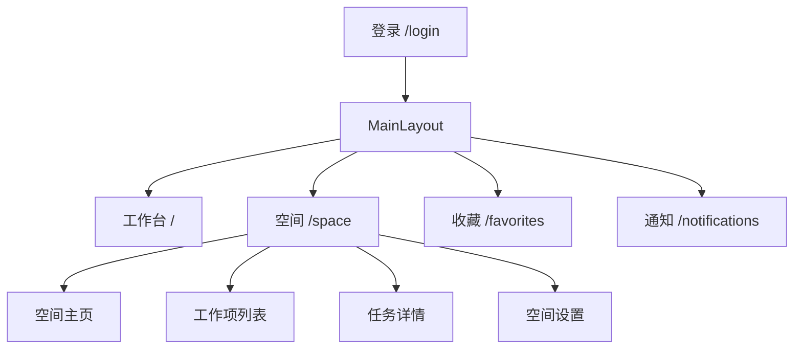
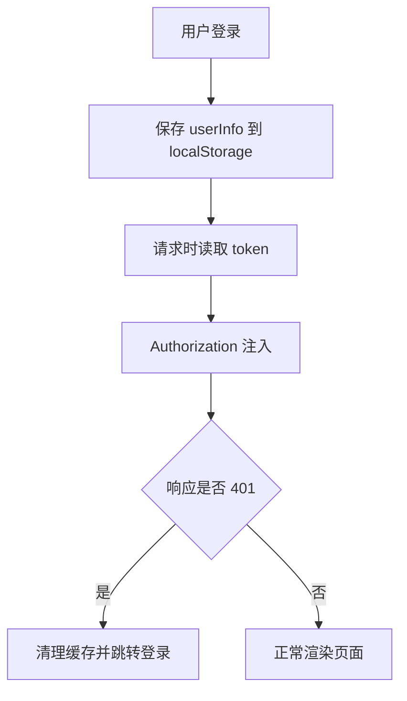
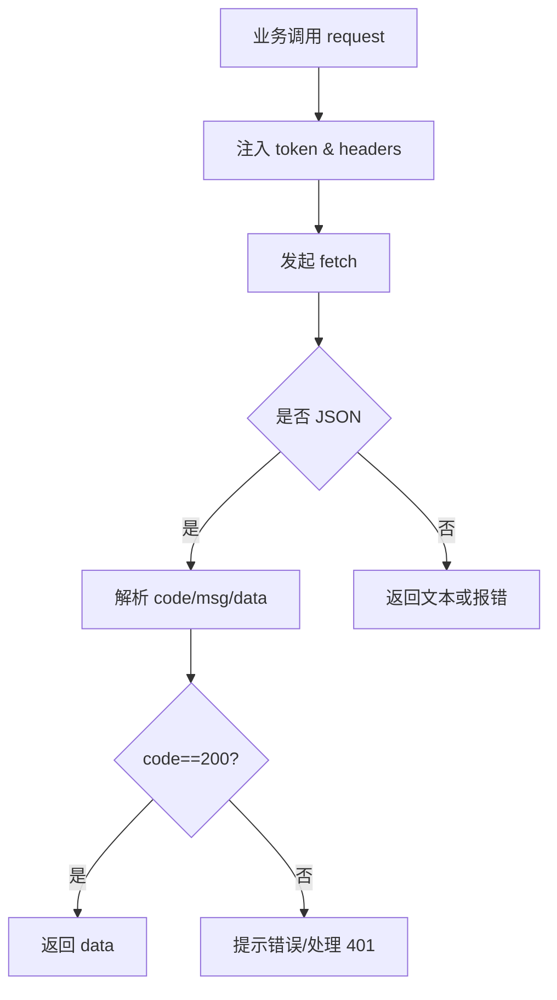
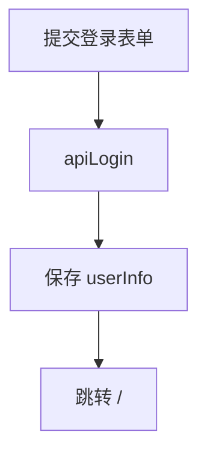
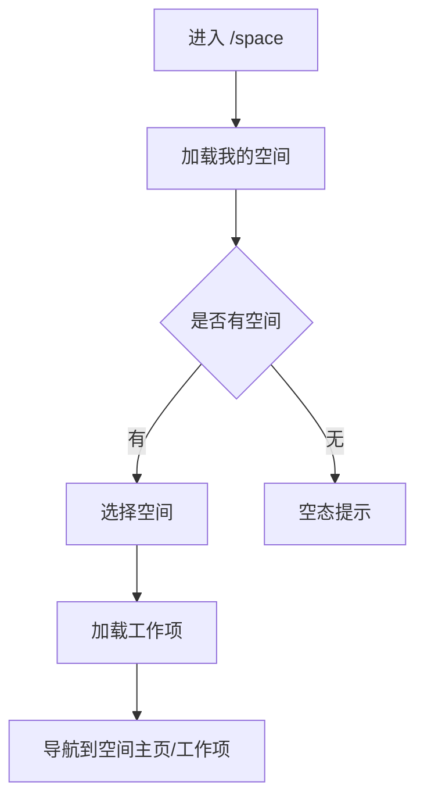
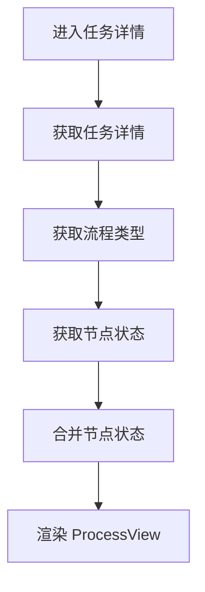

# 前端说明书（技术栈、架构设计、模块设计、数据库关系）

本文档基于当前前端代码结构与后端数据库说明整理，内容覆盖技术栈、架构与鉴权方案、模块设计与执行流程、表设计与关系及其他关键设计说明，行文风格遵循毕业设计要求。

---

## 一、技术栈与运行环境

### 1.1 技术栈
- **框架**：React 18 + TypeScript
- **构建工具**：Vite 7
- **路由**：React Router（Data Mode）
- **状态管理**：Zustand
- **UI 组件库**：Ant Design 5.x + 图标库 `@ant-design/icons`
- **样式方案**：Tailwind CSS 4.x
- **流程图引擎**：Cytoscape.js + `cytoscape-edgehandles` + `cytoscape-popper`
- **富文本**：Tiptap（`@tiptap/react` + `starter-kit`）
- **工具库**：`dayjs`、`lodash-es`

### 1.2 运行与配置
- **启动**：`npm run dev`
- **接口前缀**：`VITE_API_BASE`（用于拼接 API 与图片地址）
- **类型共享**：通过 `src/backend.d.ts` 引入后端 DTO 类型

### 1.3 目录结构与职责概览
```
src/
├─ api/                 # 通用请求封装
├─ assets/              # 静态资源
├─ components/          # 通用组件（如流程图、任务详情）
├─ constants/           # 常量与枚举
├─ hooks/               # 通用 Hook（如 useRequest）
├─ layouts/             # 全局布局
├─ pages/               # 页面级模块（按路由域划分）
├─ router/              # 路由配置
├─ store/               # 全局状态（zustand）
├─ styles/              # 全局样式
├─ types/               # 类型声明
└─ utils/               # 工具方法
```

---

## 二、前端架构设计

### 2.1 分层与职责
前端采用“**页面模块层 + 组件层 + 基础设施层**”的结构：
- **基础设施层**：`api/request.ts` 负责统一网络请求、鉴权、错误处理与超时控制。
- **组件层**：`components/` 聚合可复用视图与复杂交互（如 `ProcessView`、`TaskDetailPage`）。
- **页面层**：`pages/` 按业务域组织，路由由 `router/routes` 统一配置。

### 2.2 路由与布局
系统以 `MainLayout` 作为全局框架，所有业务页面作为子路由挂载。空间域使用二级布局 `SpaceWorkItemLayout` 组织“空间列表 + 工作项列表 + 主内容区”的结构。



### 2.3 鉴权与会话管理
前端以“**JWT Token + 本地缓存**”完成鉴权：
- 登录成功后写入 `localStorage.userInfo`。
- 请求拦截层自动注入 `Authorization: Bearer <token>`。
- 当 API 返回 401 或统一响应 `code=401` 时，自动清理缓存并跳转 `/login`。



### 2.4 请求封装与统一响应
`api/request.ts` 负责：
- 超时控制（默认 10s）
- 自动序列化 JSON
- 统一响应 `{ code, msg, data }` 解包
- 错误统一提示与异常抛出



---

## 三、模块设计与执行流程（Standard 形式）

以下模块均按“**目标—前置条件—输入—处理—输出—异常**”标准形式描述其执行流程。

### 3.1 登录与注册模块
**目标**：完成用户身份认证与账户注册。  
**前置条件**：登录或注册表单校验通过。  
**输入**：`emailOrUsername/password` 或 `name/email/password`。  
**处理**：调用 `/auth/login` 或 `/auth/register`；登录成功后写入本地缓存并跳转首页。  
**输出**：登录返回 `userInfo`；注册返回成功提示。  
**异常**：账号/密码错误、邮箱冲突等提示。



### 3.2 工作台模块（Dashboard）
**目标**：提供用户任务统计与快捷入口。  
**前置条件**：用户已登录。  
**输入**：任务分类（todo/done/part 等）、分页信息。  
**处理**：调用 `/tasks/dashboard` 与 `/tasks/dashboard/stats`；按状态字段映射展示列表。  
**输出**：统计卡片 + 表格数据。  
**异常**：接口异常时展示空态或错误提示。

### 3.3 空间与工作项模块（Space）
**目标**：展示用户空间与工作项，并驱动后续业务。  
**前置条件**：已登录，拥有空间权限。  
**输入**：空间 ID、工作项 ID。  
**处理**：加载空间列表 → 选中空间 → 拉取工作项 → 路由跳转。  
**输出**：左侧空间/工作项列表与主内容区。  
**异常**：加载失败时展示重试按钮。



### 3.4 空间主页模块（Overview）
**目标**：展示空间主页与富文本内容。  
**前置条件**：已登录，存在空间。  
**输入**：空间 ID。  
**处理**：并行加载空间详情与权限 → 渲染内容 → 管理员可编辑并保存。  
**输出**：空间主页内容。  
**异常**：加载或保存失败提示。

### 3.5 工作项列表模块（WorkItem）
**目标**：展示任务列表与任务统计，支持新增与编辑。  
**前置条件**：已登录，存在工作项。  
**输入**：工作项 ID、分页参数、查询类型。  
**处理**：拉取任务列表与统计 → 展开字段状态 → 允许表格内编辑并保存。  
**输出**：任务列表与统计卡片。  
**异常**：保存失败提示并保持原状态。

### 3.6 任务详情模块（TaskDetail）
**目标**：展示任务流程节点、状态与详情信息。  
**前置条件**：任务存在且用户有访问权限。  
**输入**：任务 ID、工作项 ID、空间 ID。  
**处理**：获取任务详情 → 获取流程节点 → 获取节点状态 → 合并渲染 `ProcessView`。  
**输出**：任务流程图 + 底部详情区。  
**异常**：接口失败时进入加载失败状态或兜底数据。



### 3.7 收藏模块（Favorites）
**目标**：展示用户收藏任务，并支持快速打开详情。  
**前置条件**：已登录且存在收藏。  
**输入**：收藏列表、任务 ID、工作项 ID。  
**处理**：拉取收藏 → 批量获取任务与工作项 → 生成侧边列表 → 展示详情。  
**输出**：收藏列表与任务详情。  
**异常**：任一任务异常时跳过并忽略。

### 3.8 通知模块（Notifications）
**目标**：展示通知列表并支持标记已读。  
**前置条件**：已登录。  
**输入**：分页参数、标签筛选。  
**处理**：分页拉取通知 → 滚动触底加载 → 标记已读/全部已读。  
**输出**：通知列表（支持 @我过滤）。  
**异常**：拉取失败时提示并保留已有数据。

### 3.9 空间设置模块（Settings）
**目标**：提供空间信息、权限与工作项设置。  
**前置条件**：已登录，空间管理员或成员。  
**输入**：空间 ID、工作项 ID。  
**处理**：  
- 空间信息：更新名称/图标，支持删除空间。  
- 权限管理：分页拉取成员，支持搜索与邀请。  
- 工作项管理：创建、编辑、删除工作项类型；进入字段/角色/流程配置。  
**输出**：配置结果与提示信息。  
**异常**：接口失败时提示并回滚 UI。

---

## 四、数据库表设计与关系（前端视角）

前端主要围绕以下实体与关系进行展示与操作（字段定义来源于 `agents/db.md`）：

### 4.1 核心实体
- **space**：空间（空间主页、空间设置与工作项域）
- **user**：用户（登录、成员、评论与通知）
- **space_user**：空间-用户关系（权限与成员管理）
- **workItem**：工作项类型（任务类型与字段配置）
- **workItemField**：工作项字段（表格列、任务字段渲染）
- **workItemRole**：工作项角色（任务节点负责人）
- **workflowType**：流程模板（流程图节点与连线）
- **task**：任务实体（工作项实例）
- **task_node_statuses**：任务节点状态（流程图状态）
- **task_comments**：任务评论（通知来源）
- **favorites**：收藏（收藏列表）
- **notices**：通知（通知列表与未读数）

### 4.2 关系说明（简化）
- **space 1—N workItem**：空间包含多个工作项类型。
- **workItem 1—N task**：工作项类型下存在多个任务。
- **workItem 1—N workItemField**：工作项字段决定任务列表与编辑形态。
- **workItem 1—N workflowType**：工作项流程模板与流程图渲染。
- **task 1—N task_node_statuses**：任务流程节点状态推进。
- **task 1—N task_comments**：任务评论与 @ 提醒来源。
- **user N—N space**：通过 `space_user` 维护权限与成员关系。
- **user 1—N notices**：通知中心的接收者与发送者。

---

## 五、其他设计说明

### 5.1 状态管理
`zustand` 用于管理全局状态（如登录用户、通知未读数），避免在页面层层传递。

### 5.2 富文本与图片上传
空间主页采用 Tiptap 作为富文本内核，图片上传走 `/upload/image`，并使用 `VITE_API_BASE` 拼接回显地址。

### 5.3 流程图可视化
`ProcessView` 作为流程图核心组件，基于 Cytoscape 实现节点布局、曲线连线与编辑模式，支持流程节点状态颜色标识与交互操作。

### 5.4 表格编辑与字段驱动
工作项列表与字段管理严格依赖 `workItemField` 定义，系统字段与自定义字段统一渲染与保存，保证配置驱动的扩展性。

### 5.5 统一错误处理
网络层统一处理超时、401、业务错误码，并以 Ant Design Notification 反馈，保证交互一致性。

---

## 六、小结
前端整体架构以 React + Vite 为基础，通过统一请求层、清晰的模块化路由与组件体系实现业务闭环。鉴权与会话管理稳定、工作项与流程模块逻辑完整，结合富文本与流程图可视化提升系统的管理表达能力，为后续功能扩展提供了良好的工程基础。

---

## 七、路由结构与页面清单（依据 `src/router/routes`）

### 7.1 路由层级
- **根路由**：`/` → `App` → `MainLayout`  
  - **工作台**：`/` → `TablePage`  
  - **空间域**：`/space` → `SpaceWorkItemLayout`  
    - 空间主页：`/space/:spaceId/overview`  
    - 空间设置：`/space/:spaceId/settings`  
      - 空间信息：`/space/:spaceId/settings`  
      - 工作项管理：`/space/:spaceId/settings/workItem`  
      - 权限管理：`/space/:spaceId/settings/permission`  
    - 工作项列表：`/space/:spaceId/:workItemId`  
    - 任务详情：`/space/:spaceId/:workItemId/:taskId/detail`  
  - **收藏**：`/favorites`  
  - **通知**：`/notifications`  
- **登录**：`/login`

### 7.2 页面职责对照表
| 页面 | 主要功能 | 关键组件 |
| --- | --- | --- |
| 工作台 `/` | 任务统计、分类列表、快捷跳转 | `GreetingHeader`、`CategoryList` |
| 空间主页 | 富文本展示与编辑 | `RichTextEditor` |
| 工作项列表 | 任务表格、内联编辑、新建任务 | `WorkItemStatusView`、`MeegleCardFrame` |
| 任务详情 | 流程图 + 详情区 | `ProcessView`、`ProcessBottomInfo` |
| 收藏 | 收藏任务侧栏 + 详情 | `TaskDetailPage` |
| 通知 | 分页、滚动加载、标记已读 | `MentionMeNotification` |
| 空间设置 | 基础信息、工作项配置、权限管理 | `SpaceInfo`、`WorkItemSettings`、`PermissionSettings` |

---

## 八、核心组件与复用设计

### 8.1 组件分层
- **通用组件**（`src/components`）  
  - `ProcessView`：流程图渲染核心，基于 Cytoscape 实现布局与交互  
  - `TaskDetailPage`：任务详情聚合组件，复用到收藏与任务详情路由  
  - `MemberSelect`：成员选择器，支持单/多选  
  - `UserProfileCard`：用户信息展示  
- **页面组件**（`src/pages`）  
  - 按业务域聚合（工作台、空间、收藏、通知、登录）

### 8.2 流程图组件（`ProcessView`）
- **数据输入**：`nodes: ProcessNodeType[]`  
- **布局机制**：将业务节点解析为 Cytoscape 元素，通过控制点绘制曲线连线  
- **交互行为**：支持节点悬停、点击、选择态、边连线（编辑模式）  
- **状态映射**：节点状态颜色根据 `status` 映射，便于展示任务流程进度

### 8.3 任务详情聚合（`TaskDetailPage`）
- **数据加载**：`useTaskDetailData` 拉取任务、节点、收藏状态  
  - 失败时展示加载态，避免空白页面  
- **交互**：收藏/取消收藏、关闭返回工作项列表  
- **数据回写**：进入详情后记录最近浏览 `/recent-views`

---

## 九、数据交互与接口约定

### 9.1 统一请求封装
- `api/request.ts` 封装 `fetch`：
  - 支持超时控制、统一响应 `{code, msg, data}` 解析  
  - 自动注入 `Authorization: Bearer <token>`  
  - 401 自动清理 `localStorage.userInfo` 并跳转 `/login`  
  - 统一错误提示（Ant Design Notification）

### 9.2 关键接口示例（前端视角）
- 登录注册：`/auth/login`、`/auth/register`  
- 工作台：`/tasks/dashboard`、`/tasks/dashboard/stats`  
- 空间数据：`/spaces`、`/spaces/:id`  
- 工作项：`/workItems/:id`、`/workItems/:id/fields`  
- 任务：`/tasks`、`/tasks/workItem/:id`、`/tasks/:id`  
- 流程：`/workflow-types/workItem/:id`、`/task-node-status/:taskId/nodes/:nodeId`  
- 通知：`/notices`、`/notices/unread-count`  

---

## 十、状态管理与缓存策略

### 10.1 Zustand 状态存储
- `useUserStore`：缓存登录用户信息（与 `localStorage` 同步）  
- `useNoticeBadgeStore`：未读通知数量与刷新能力  

### 10.2 请求级缓存（Hook 设计）
`useRequest` 提供：
- 防重复请求（loading guard）  
- 基础缓存（默认 60s）  
- 状态机：`ready/pending/ok/error`  
- 可插拔数据合并 `combiner`  

---

## 十一、权限与安全设计（前端层）

### 11.1 鉴权与会话
- 登录成功后写入 `localStorage.userInfo`  
- 请求层统一注入 Token  
- 401 处理：清理缓存并跳转登录  

### 11.2 访问控制策略
- 通过接口返回的权限字段（如空间成员/管理员）决定按钮可见性  
- 例如空间主页仅管理员可编辑（`checkSpacePermission`）

---

## 十二、关键业务流程补充（毕业设计常用视角）

### 12.1 工作项内联编辑流程
1. 用户点击表格单元格进入编辑  
2. 提交后构造 `fieldStatusList` 并调用 `PUT /tasks/:id`  
3. 成功后更新表格行数据并提示保存成功  

### 12.2 任务创建流程
1. 打开新建任务弹窗 → 拉取字段、流程、角色、成员  
2. 用户填写字段值，生成 `fieldStatusList`  
3. 提交 `POST /tasks` 创建任务  
4. 若流程节点存在角色配置，追加更新节点负责人  

### 12.3 收藏管理流程
1. 任务详情点击收藏 → 更新收藏状态  
2. 收藏页拉取收藏列表 + 任务详情  
3. 侧边栏选择收藏任务 → 复用 `TaskDetailPage`

---

## 十三、界面与交互设计要点

### 13.1 视觉规范
- Ant Design 组件库 + Tailwind 工具类  
- 常见色值：主色 `#3250eb`，边框 `#cacbcd`

### 13.2 交互一致性
- 表单统一校验规则（登录/注册/新增字段等）  
- 列表采用加载态 + 空态（`Spin` + `Empty`）  
- 顶部一致性栏位（icon + title + 操作）

---

## 十四、性能与可用性设计

### 14.1 性能策略
- 列表分页/滚动加载（通知模块）  
- 缓存 `status` 字段 options（工作台）  
- Cytoscape 渲染时控制 pan 边界，避免过度重绘  

### 14.2 可用性与容错
- 网络错误统一提示  
- 空数据兜底（空态组件）  
- 失败重试（空间/工作项加载失败可重试）

---

## 十五、测试与验收建议（论文常见内容）

### 15.1 功能测试
- 登录/注册校验  
- 空间切换、工作项选择、任务详情展示  
- 任务创建、字段编辑、收藏/取消收藏  
- 通知加载与已读状态切换  

### 15.2 兼容性测试
- Chrome / Edge  
- 常用分辨率下布局适配（宽屏/笔记本）

---

## 十六、部署与运行说明（前端）

- 安装依赖：`npm install`  
- 启动开发环境：`npm run dev`  
- 环境变量：`VITE_API_BASE` 用于配置 API 前缀  

---

## 十七、可扩展性与不足

### 17.1 可扩展方向
- 权限体系细化（角色/资源级）  
- 组件层抽象为独立设计系统  
- 数据统计与可视化大屏

### 17.2 已知不足
- 缺少系统级自动化测试用例  
- 多语言与无障碍支持未完善  
