# 后端说明书（技术栈、架构设计、模块设计、数据库设计）

本文档基于当前后端代码与数据库说明整理，内容覆盖技术栈、架构与鉴权方案、模块设计与执行流程、表设计与关系及其他关键设计说明，行文风格遵循毕业设计要求。

---

## 一、技术栈与运行环境

### 1.1 技术栈
- **框架**：NestJS（基于 TypeScript）
- **ORM**：Sequelize + sequelize-typescript
- **数据库**：MySQL
- **认证与授权**：JWT（`@nestjs/jwt` + `jsonwebtoken`）
- **事件系统**：`@nestjs/event-emitter`
- **文件上传**：`@nestjs/platform-express` + `FileInterceptor`
- **序列化与响应**：统一响应拦截器 + 全局异常过滤器

### 1.2 运行与配置
- **启动**：`pnpm run start:dev`
- **环境变量（关键）**：
  - `MYSQL_HOST` / `MYSQL_PORT` / `MYSQL_USERNAME` / `MYSQL_PASSWORD` / `MYSQL_DATABASE`
  - `JWT_SECRET`（默认 `mini-meegle-secret`）
  - `PORT`（默认 3000）
  - `CORS_ORIGIN`（默认放行）

### 1.3 目录结构与职责概览
后端代码采用模块化组织方式，核心目录结构如下（省略 `dist/`、`node_modules/`）：

```
src-backend/
├─ src/                 # 业务与基础设施代码
│  ├─ auth/             # 认证与授权（JWT）
│  ├─ common/           # 全局异常与响应拦截器
│  ├─ space/            # 空间与初始化逻辑
│  ├─ space-user/       # 空间成员关系
│  ├─ work-item/        # 工作项
│  ├─ work-item-field/  # 工作项字段
│  ├─ work-item-role/   # 工作项角色
│  ├─ workflow-type/    # 流程模板
│  ├─ task/             # 任务实体
│  ├─ task-nodestatus/  # 节点状态流转与子任务
│  ├─ task-comment/     # 评论与 @ 提及
│  ├─ notice/           # 通知中心（事件驱动）
│  ├─ favorites/        # 收藏
│  ├─ recent-view/      # 最近访问
│  ├─ upload/           # 图片上传
│  ├─ user/             # 用户管理
│  ├─ example-user/     # 示例用户（演示用途）
│  ├─ utils/            # 工具方法（如 ID 生成）
│  └─ main.ts           # 启动入口
├─ test/                # e2e 测试
├─ package.json         # 依赖与脚本
└─ tsconfig*.json       # TypeScript 配置
```

### 1.4 关键依赖与版本（节选）
- **NestJS**：`@nestjs/common/core/platform-express`
- **ORM**：`sequelize` + `sequelize-typescript` + `@nestjs/sequelize`
- **认证**：`@nestjs/jwt` + `jsonwebtoken`
- **数据库驱动**：`mysql2`
- **事件系统**：`@nestjs/event-emitter`
- **测试框架**：`jest` + `supertest`

---

## 二、后端架构设计

### 2.1 分层架构
后端采用典型的 NestJS 分层结构：Controller 负责接口与参数校验，Service 负责业务逻辑，Model 负责数据映射与持久化。统一的响应拦截器与异常过滤器位于全局层，保证 API 一致性。

### 2.2 请求处理总流程
所有请求按以下流程进入系统，形成统一处理闭环：

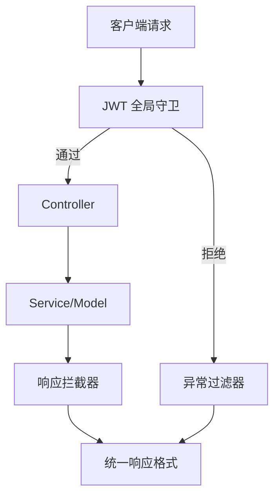
```mermaid
flowchart TD
  A[客户端请求] --> B[JWT 全局守卫]
  B -->|通过| C[Controller]
  B -->|拒绝| E[异常过滤器]
  C --> D[Service/Model]
  D --> F[响应拦截器]
  F --> G[统一响应格式]
  E --> G
```

**统一响应格式：**
`{ code, msg, data }`，其中 `code` 为 HTTP 状态码，`msg` 为提示信息，`data` 为数据体。

### 2.3 鉴权设计
系统采用 JWT 进行身份认证。除显式标注 `@Public()` 的接口外，默认均受 `JwtAuthGuard` 保护。认证流程如下：

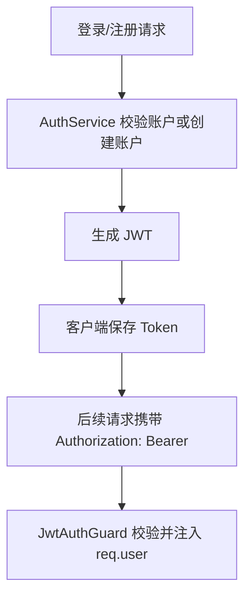
```mermaid
flowchart TD
  A[登录/注册请求] --> B[AuthService 校验账户或创建账户]
  B --> C[生成 JWT]
  C --> D[客户端保存 Token]
  D --> E[后续请求携带 Authorization: Bearer]
  E --> F[JwtAuthGuard 校验并注入 req.user]
```

**关键说明：**
- Token 过期时间为 1 小时。
- 登录成功后返回 `access_token`、`token_type`、`expires_in` 及用户信息（去除密码字段）。
- 密码使用 MD5 摘要保存（业务示例性质，实际生产应替换为更安全的算法）。

### 2.4 全局守卫、拦截器与异常过滤
系统通过全局组件统一控制访问与响应，保证接口输出一致性：

- **全局守卫**：`JwtAuthGuard` 注入 `req.user`，并在未登录或 token 失效时抛出 401。
- **响应拦截器**：`ResponseInterceptor` 将成功返回统一包装为 `{ code: 200, msg: 'success', data }`。
- **异常过滤器**：`HttpExceptionFilter` 统一将异常封装为 `{ code: httpStatus, msg, data: null }`。

### 2.5 静态资源、上传与 CORS
后端在启动时开启静态资源目录 `uploads`，以 `/uploads/` 为前缀提供访问，并配置 CORS：

- **静态文件**：`app.useStaticAssets(join(process.cwd(), 'uploads'), { prefix: '/uploads/' })`  
- **上传限制**：仅允许图片类型，单文件 ≤ 5MB  
- **请求体限制**：JSON 与表单请求体大小上限为 10MB  
- **CORS**：允许常见方法与请求头，可通过 `CORS_ORIGIN` 收敛来源

### 2.6 ORM 配置与数据库连接
项目在 `AppModule` 中配置 Sequelize，核心策略如下：

- `autoLoadModels: true` 自动加载模型  
- `synchronize: true` 自动同步模型到数据库  
- `charset/collate: utf8mb4` 支持多语言与表情  
- 连接池配置（`max/min/acquire/idle`）保证并发性能

### 2.7 事件驱动设计（通知系统）
评论模块在创建时通过事件总线派发 `task_comments.mention` 事件，通知模块监听并生成通知记录，实现松耦合扩展。

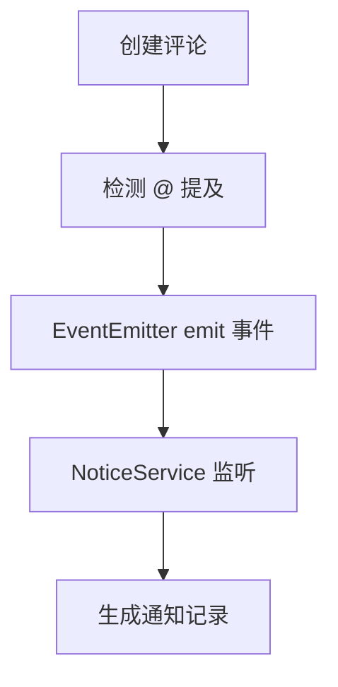
```mermaid
flowchart TD
  A[创建评论] --> B[检测 @ 提及]
  B --> C[EventEmitter emit 事件]
  C --> D[NoticeService 监听]
  D --> E[生成通知记录]
```

---

## 三、模块设计与执行流程（Standard 形式）

以下模块均按“**目标—前置条件—输入—处理—输出—异常**”标准形式描述其执行流程。

### 3.0 接口与 DTO 约定（通用）
- 所有 Controller 接口使用 DTO 进行参数校验（`class-validator`），避免脏数据进入 Service。
- 受 `JwtAuthGuard` 保护的接口均可从 `req.user` 中获取当前用户信息。
- 列表分页通常采用 `offset/limit`，并对 `limit` 做最大值限制（通常不超过 100）。

### 3.1 Auth 模块
**目标**：完成用户注册与登录认证。

**流程（注册）**  
前置条件：邮箱或用户名未注册。  
输入：`name`、`email`、`password`。  
处理：检查重复 -> MD5 加密 -> 创建用户 -> 返回用户信息。  
输出：用户基本信息。  
异常：邮箱或用户名冲突（409）。

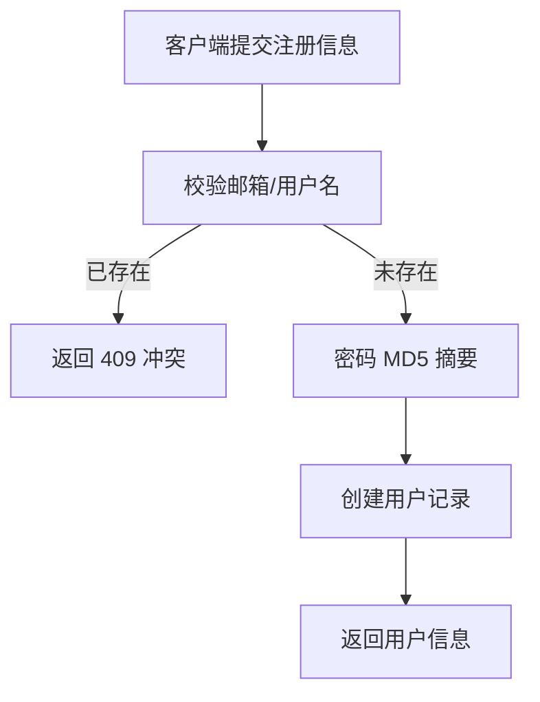
```mermaid
flowchart TD
  A[客户端提交注册信息] --> B[校验邮箱/用户名]
  B -->|已存在| E[返回 409 冲突]
  B -->|未存在| C[密码 MD5 摘要]
  C --> D[创建用户记录]
  D --> F[返回用户信息]
```

**流程（登录）**  
前置条件：用户存在且密码匹配。  
输入：`emailOrUsername`、`password`。  
处理：查询用户 -> 校验密码 -> 生成 JWT -> 返回 token 与用户信息。  
输出：token 与用户信息。  
异常：账号或密码错误（401）。

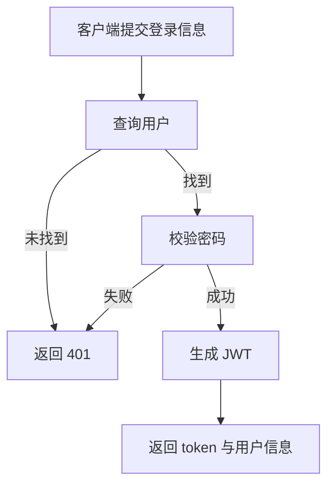
```mermaid
flowchart TD
  A[客户端提交登录信息] --> B[查询用户]
  B -->|未找到| E[返回 401]
  B -->|找到| C[校验密码]
  C -->|失败| E
  C -->|成功| D[生成 JWT]
  D --> F[返回 token 与用户信息]
```

### 3.2 User 模块
**目标**：提供用户基础信息的 CRUD 与检索。

**流程**  
前置条件：已登录（非 `@Public`）。  
输入：用户数据或查询参数。  
处理：调用 `UserService` 完成增删改查与分页搜索。  
输出：用户列表或单条用户信息。  
异常：用户不存在（404）。

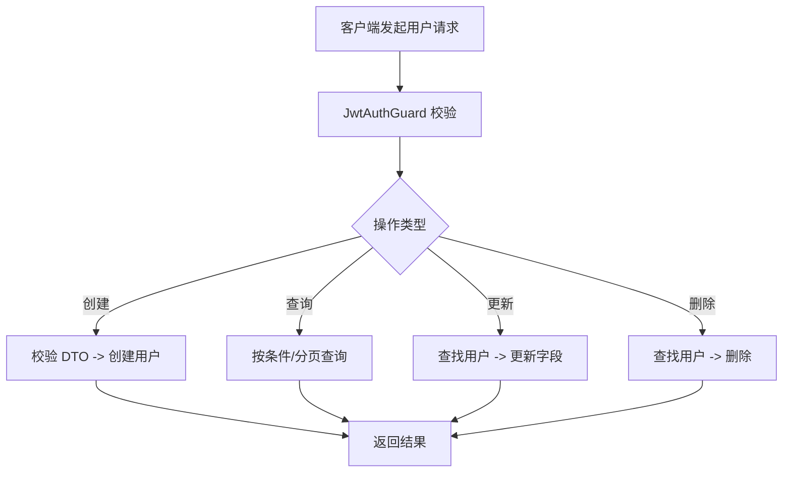
```mermaid
flowchart TD
  A[客户端发起用户请求] --> B[JwtAuthGuard 校验]
  B --> C{操作类型}
  C -->|创建| D[校验 DTO -> 创建用户]
  C -->|查询| E[按条件/分页查询]
  C -->|更新| F[查找用户 -> 更新字段]
  C -->|删除| G[查找用户 -> 删除]
  D --> H[返回结果]
  E --> H
  F --> H
  G --> H
```

### 3.3 Space 模块
**目标**：管理空间实体及其初始化数据。

**流程（创建空间）**  
前置条件：用户已登录，且无并发创建冲突。  
输入：空间基础信息。  
处理：事务内创建空间 -> 写入空间-用户关系（管理员）-> 初始化主页内容 -> 初始化工作项、字段、角色、流程、示例任务。  
输出：创建完成的空间信息。  
异常：并发创建冲突（403）、事务异常。

```mermaid
flowchart TD
  A[请求创建空间] --> B[事务开始]
  B --> C[创建空间记录]
  C --> D[写入空间-用户关系(管理员)]
  D --> E[初始化主页内容]
  E --> F[初始化工作项]
  F --> G[初始化字段]
  G --> H[初始化角色]
  H --> I[初始化流程类型]
  I --> J[初始化示例任务]
  J --> K[提交事务]
```

**流程（删除空间）**  
前置条件：操作者为管理员。  
输入：空间 ID。  
处理：事务内级联删除工作项、流程、任务、节点状态、空间关系等数据。  
输出：删除成功。  
异常：无权限或空间不存在。

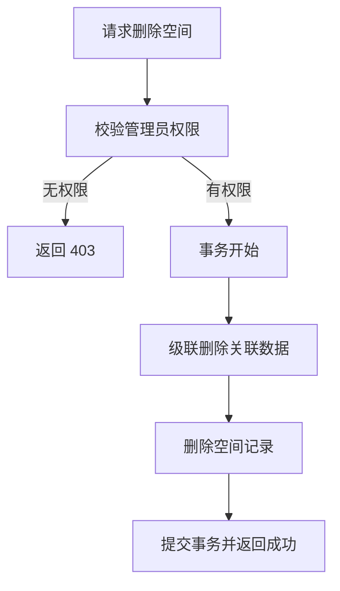
```mermaid
flowchart TD
  A[请求删除空间] --> B[校验管理员权限]
  B -->|无权限| E[返回 403]
  B -->|有权限| C[事务开始]
  C --> D[级联删除关联数据]
  D --> F[删除空间记录]
  F --> G[提交事务并返回成功]
```

**实现要点**  
空间初始化数据来源于 `space/INIT.ts`，包括默认工作项类型、字段、角色、流程模板与示例任务，用于保证新空间即开即用。

### 3.4 SpaceUser 模块
**目标**：管理空间与用户的成员关系。

**流程**  
前置条件：空间存在。  
输入：空间 ID、用户 ID 集合。  
处理：批量写入成员关系（忽略重复），支持权限级别。  
输出：成员列表或新增结果。  
异常：参数错误或权限不足。

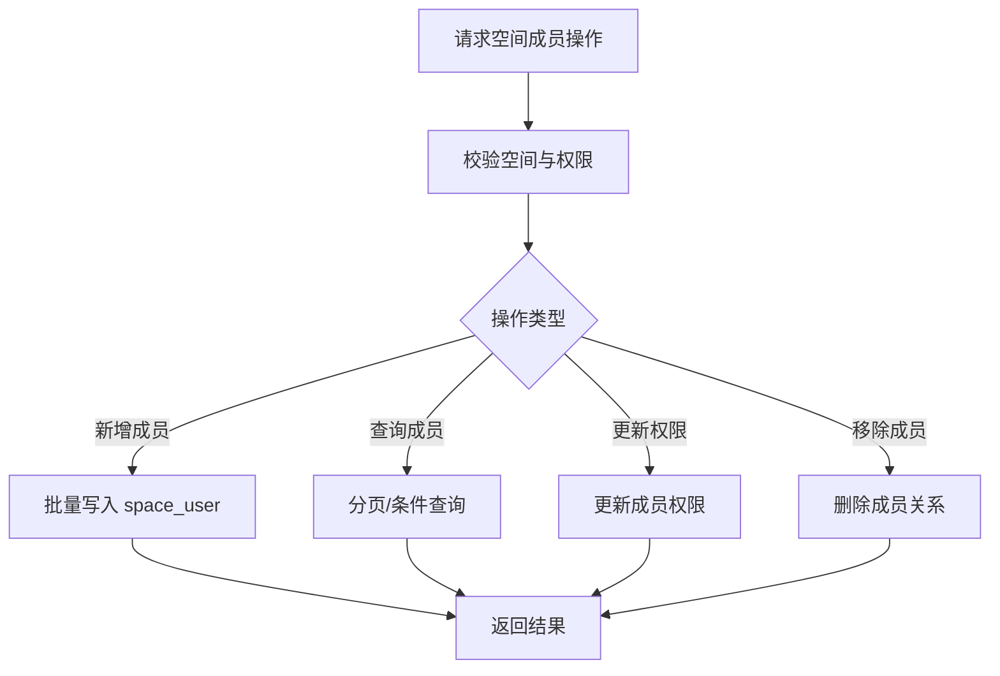
```mermaid
flowchart TD
  A[请求空间成员操作] --> B[校验空间与权限]
  B --> C{操作类型}
  C -->|新增成员| D[批量写入 space_user]
  C -->|查询成员| E[分页/条件查询]
  C -->|更新权限| F[更新成员权限]
  C -->|移除成员| G[删除成员关系]
  D --> H[返回结果]
  E --> H
  F --> H
  G --> H
```

### 3.5 WorkItem 模块
**目标**：管理工作项（需求/缺陷/任务类型）。

**流程**  
前置条件：空间存在。  
输入：工作项信息。  
处理：创建工作项并写入 `workItem_space` 关系表。  
输出：工作项信息。  
异常：ID 冲突或不存在。

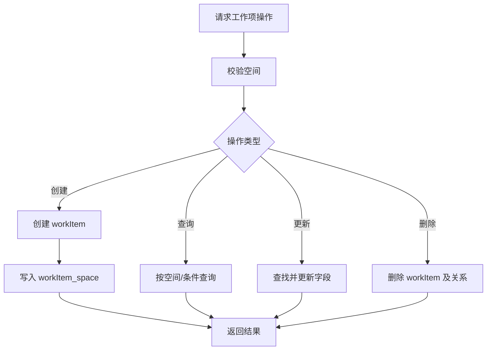
```mermaid
flowchart TD
  A[请求工作项操作] --> B[校验空间]
  B --> C{操作类型}
  C -->|创建| D[创建 workItem]
  D --> D2[写入 workItem_space]
  C -->|查询| E[按空间/条件查询]
  C -->|更新| F[查找并更新字段]
  C -->|删除| G[删除 workItem 及关系]
  D2 --> H[返回结果]
  E --> H
  F --> H
  G --> H
```

### 3.6 WorkItemField 模块
**目标**：管理工作项字段配置。

**流程**  
前置条件：工作项存在。  
输入：字段信息（类型、配置）。  
处理：创建/查询/更新/删除字段；系统字段禁止删除。  
输出：字段列表或字段信息。  
异常：字段不存在或系统字段删除禁止。

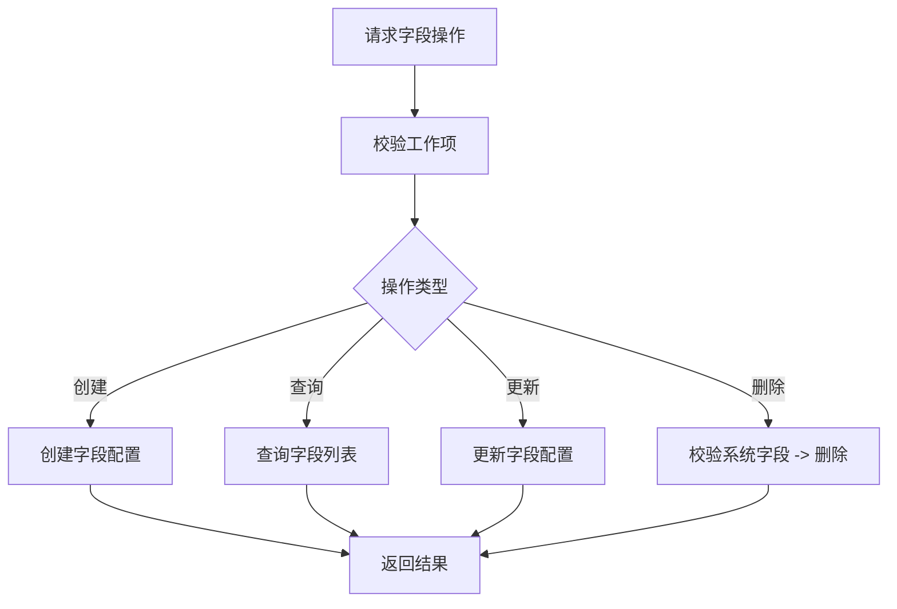
```mermaid
flowchart TD
  A[请求字段操作] --> B[校验工作项]
  B --> C{操作类型}
  C -->|创建| D[创建字段配置]
  C -->|查询| E[查询字段列表]
  C -->|更新| F[更新字段配置]
  C -->|删除| G[校验系统字段 -> 删除]
  D --> H[返回结果]
  E --> H
  F --> H
  G --> H
```

### 3.7 WorkItemRole 模块
**目标**：管理工作项角色与分配策略。

**流程**  
前置条件：工作项存在。  
输入：角色信息（显示方式、是否单选、是否自动加入）。  
处理：创建/更新/删除角色。  
输出：角色列表或角色信息。  
异常：角色不存在。

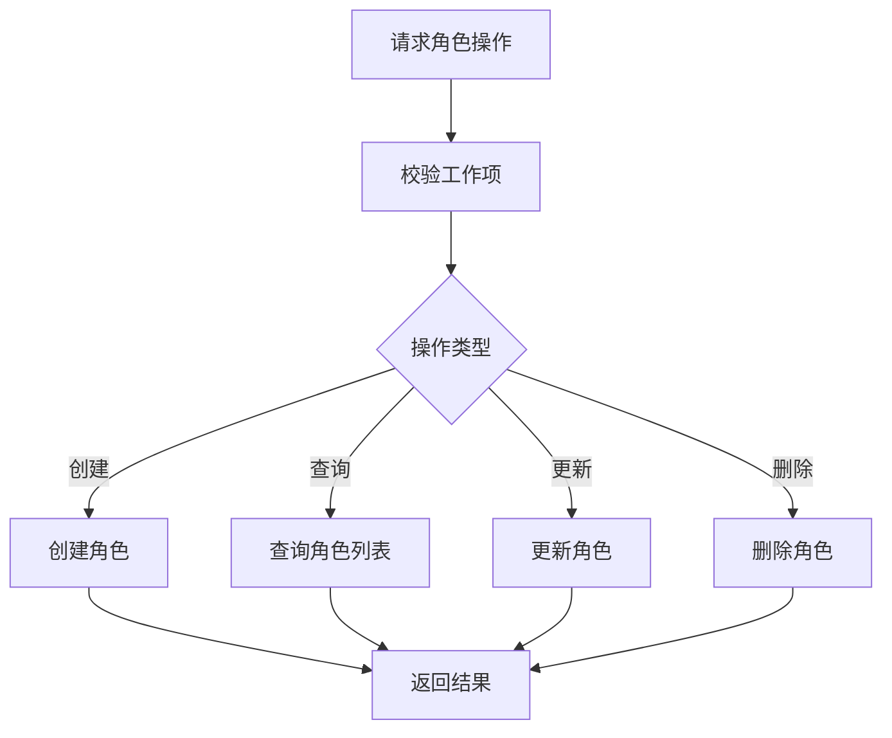
```mermaid
flowchart TD
  A[请求角色操作] --> B[校验工作项]
  B --> C{操作类型}
  C -->|创建| D[创建角色]
  C -->|查询| E[查询角色列表]
  C -->|更新| F[更新角色]
  C -->|删除| G[删除角色]
  D --> H[返回结果]
  E --> H
  F --> H
  G --> H
```

### 3.8 WorkflowType 模块
**目标**：管理工作流模板。

**流程**  
前置条件：工作项存在。  
输入：流程名称、节点数据、事件数据、角色数据。  
处理：创建/更新/删除流程。  
输出：流程列表或流程详情。  
异常：流程被任务引用时禁止删除。

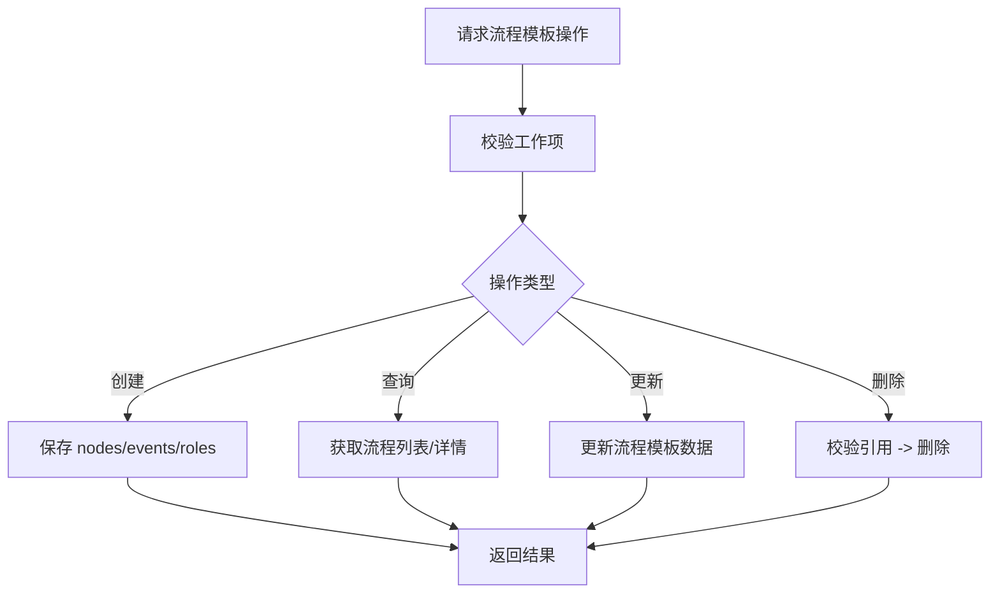
```mermaid
flowchart TD
  A[请求流程模板操作] --> B[校验工作项]
  B --> C{操作类型}
  C -->|创建| D[保存 nodes/events/roles]
  C -->|查询| E[获取流程列表/详情]
  C -->|更新| F[更新流程模板数据]
  C -->|删除| G[校验引用 -> 删除]
  D --> H[返回结果]
  E --> H
  F --> H
  G --> H
```

### 3.9 Task 模块
**目标**：管理任务实体与看板统计。

**流程（创建任务）**  
前置条件：工作项存在、流程类型有效。  
输入：字段状态列表、流程类型、所属工作项。  
处理：创建任务并记录创建者。  
输出：任务信息。  
异常：任务不存在或参数错误。

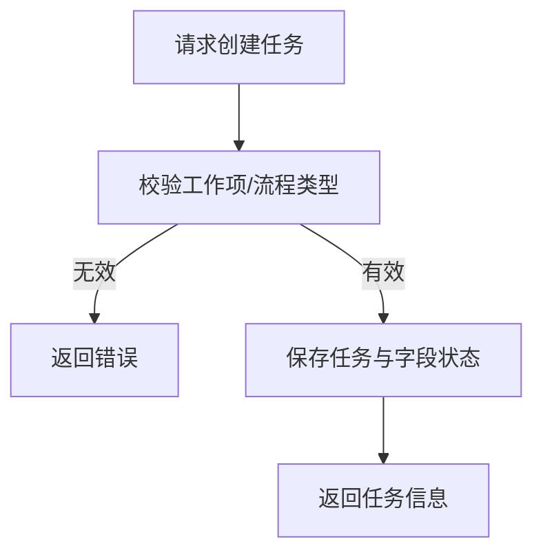
```mermaid
flowchart TD
  A[请求创建任务] --> B[校验工作项/流程类型]
  B -->|无效| E[返回错误]
  B -->|有效| C[保存任务与字段状态]
  C --> D[返回任务信息]
```

**实现要点**  
任务的字段状态通过 `fieldStatusListRaw` 持久化，Service 层在读写时将 JSON 与虚拟字段 `fieldStatusList` 相互转换。

**流程（看板统计）**  
前置条件：用户已登录。  
输入：统计类型（待办/已完成/参与等）。  
处理：结合节点状态、字段值与参与关系统计。  
输出：统计数据与列表。  
异常：无用户信息时返回空统计。

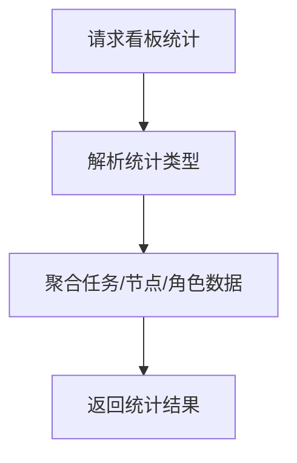
```mermaid
flowchart TD
  A[请求看板统计] --> B[解析统计类型]
  B --> C[聚合任务/节点/角色数据]
  C --> D[返回统计结果]
```

### 3.10 TaskNodeStatus 模块
**目标**：管理任务在流程节点上的状态流转与子任务。

**流程（节点流转）**  
前置条件：任务存在，节点存在。  
输入：任务 ID、节点 ID、目标状态。  
处理：校验当前状态 -> 更新节点状态 -> 依据流程规则激活后继节点 -> 触发事件并回写任务状态字段。  
输出：流转结果。  
异常：非法状态流转或节点不存在。

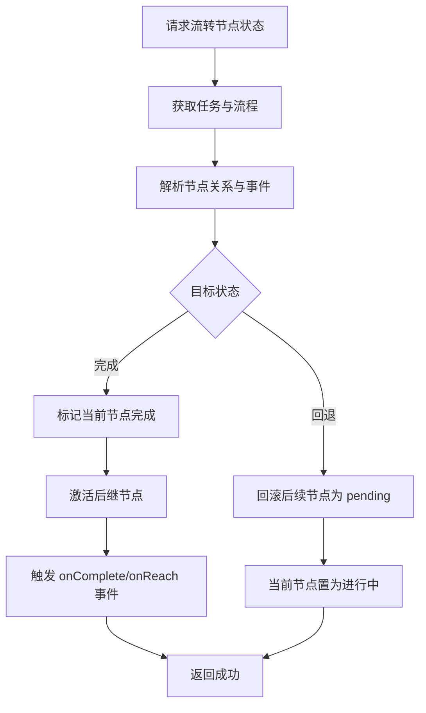
```mermaid
flowchart TD
  A[请求流转节点状态] --> B[获取任务与流程]
  B --> C[解析节点关系与事件]
  C --> D{目标状态}
  D -->|完成| E[标记当前节点完成]
  E --> F[激活后继节点]
  F --> G[触发 onComplete/onReach 事件]
  D -->|回退| H[回滚后续节点为 pending]
  H --> I[当前节点置为进行中]
  G --> J[返回成功]
  I --> J
```

**流程（子任务）**  
前置条件：任务节点存在。  
输入：子任务名称、负责人、排期。  
处理：新增/更新/删除子任务列表（JSON）。  
输出：子任务列表或单条子任务。  
异常：名称重复或记录不存在。

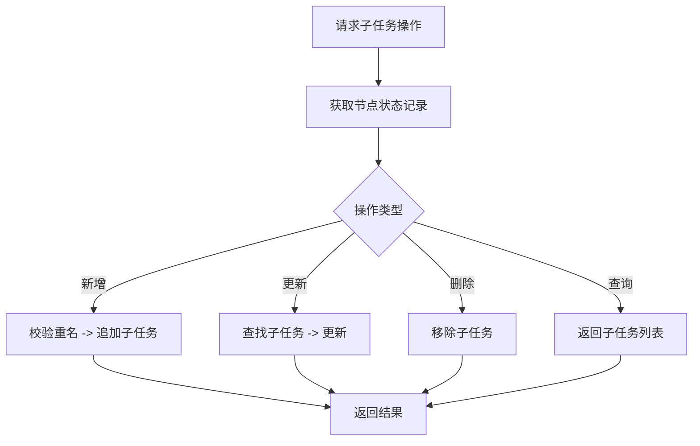
```mermaid
flowchart TD
  A[请求子任务操作] --> B[获取节点状态记录]
  B --> C{操作类型}
  C -->|新增| D[校验重名 -> 追加子任务]
  C -->|更新| E[查找子任务 -> 更新]
  C -->|删除| F[移除子任务]
  C -->|查询| G[返回子任务列表]
  D --> H[返回结果]
  E --> H
  F --> H
  G --> H
```

**实现要点**  
节点流转逻辑会解析 `workflowType.nodesData`/`eventsData`，在节点完成或回滚时触发 `status_transition` 事件并更新任务字段状态。

### 3.11 Comment 模块
**目标**：任务评论与 @ 提及。

**流程**  
前置条件：任务存在，用户已登录。  
输入：评论内容、可选回复 ID、附加数据。  
处理：创建评论 -> 若存在 @ 提及则派发事件。  
输出：评论信息。  
异常：无权限修改或删除他人评论。

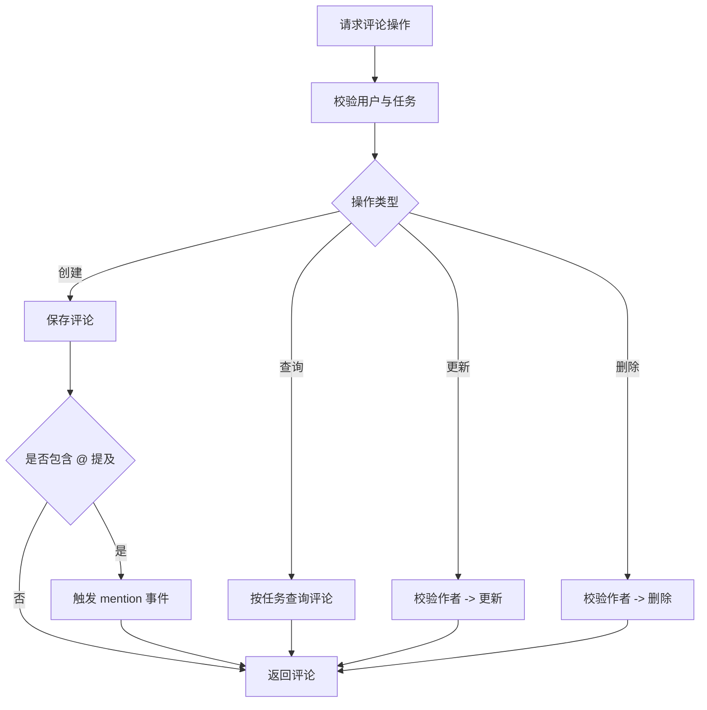
```mermaid
flowchart TD
  A[请求评论操作] --> B[校验用户与任务]
  B --> C{操作类型}
  C -->|创建| D[保存评论]
  D --> D2{是否包含 @ 提及}
  D2 -->|是| D3[触发 mention 事件]
  D2 -->|否| E[返回评论]
  D3 --> E
  C -->|查询| F[按任务查询评论]
  C -->|更新| G[校验作者 -> 更新]
  C -->|删除| H[校验作者 -> 删除]
  F --> E
  G --> E
  H --> E
```

**实现要点**  
当 `additionData.mentions` 存在时，通过事件总线派发 `task_comments.mention`，由通知模块进行异步处理。

### 3.12 Notice 模块
**目标**：系统通知与未读管理。

**流程**  
前置条件：用户已登录。  
输入：分页信息或通知 ID。  
处理：查询通知 -> 标记已读 -> 返回统计。  
输出：通知列表、未读数或成功标识。  
异常：无用户信息时返回空集。

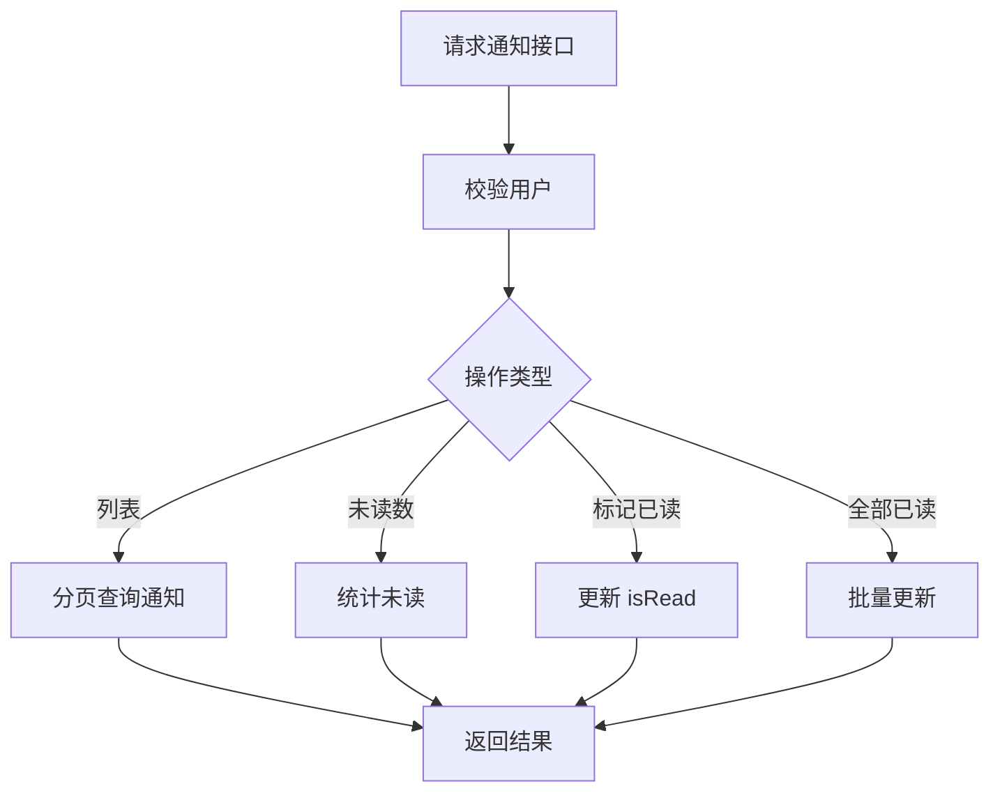
```mermaid
flowchart TD
  A[请求通知接口] --> B[校验用户]
  B --> C{操作类型}
  C -->|列表| D[分页查询通知]
  C -->|未读数| E[统计未读]
  C -->|标记已读| F[更新 isRead]
  C -->|全部已读| G[批量更新]
  D --> H[返回结果]
  E --> H
  F --> H
  G --> H
```

**实现要点**  
通知模块通过 `@OnEvent('task_comments.mention')` 监听评论事件，并生成通知记录，避免业务模块直接依赖通知逻辑。

### 3.13 Favorites 模块（TaskFavorites）
**目标**：任务收藏功能。

**流程**  
前置条件：任务存在。  
输入：任务 ID、用户 ID。  
处理：创建或删除收藏记录。  
输出：收藏列表或操作结果。  
异常：收藏不存在时删除失败。

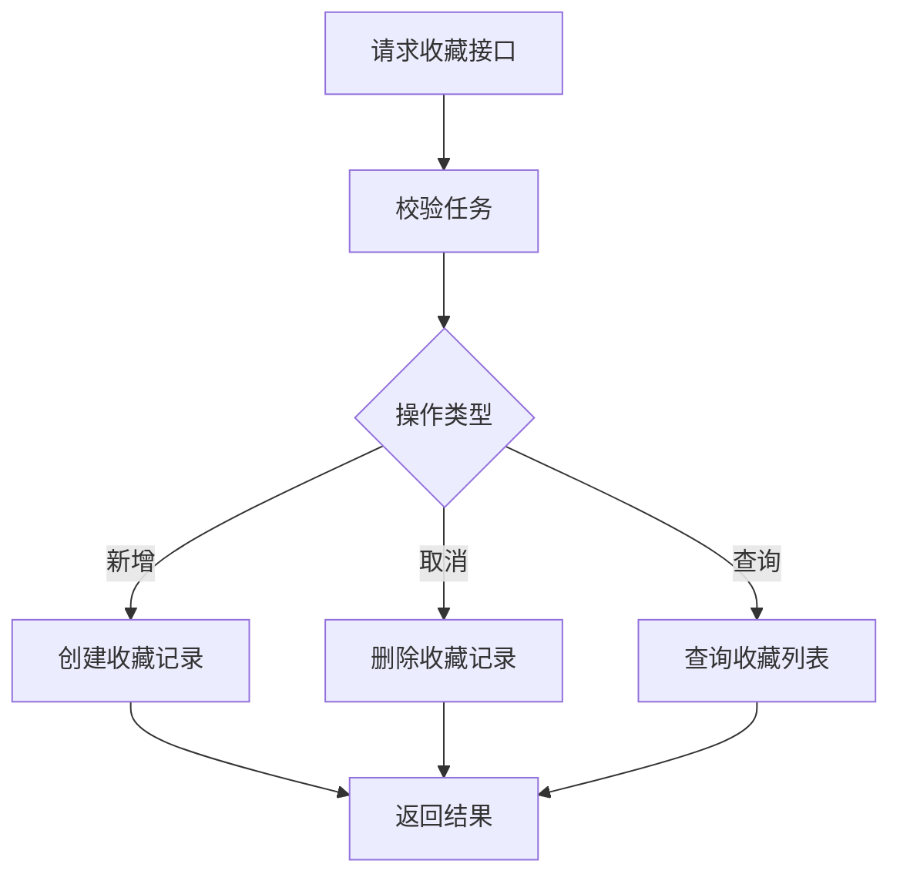
```mermaid
flowchart TD
  A[请求收藏接口] --> B[校验任务]
  B --> C{操作类型}
  C -->|新增| D[创建收藏记录]
  C -->|取消| E[删除收藏记录]
  C -->|查询| F[查询收藏列表]
  D --> G[返回结果]
  E --> G
  F --> G
```

### 3.14 RecentView 模块
**目标**：记录用户最近访问任务。

**流程**  
前置条件：用户已登录。  
输入：任务 ID 与类型。  
处理：插入或更新最近访问列表（最多 40 条）。  
输出：更新结果。  
异常：非法类型或参数不合法。

```mermaid
flowchart TD
  A[请求最近访问] --> B[校验用户]
  B --> C{操作类型}
  C -->|写入/更新| D[插入或更新列表]
  C -->|查询| E[返回最近访问列表]
  D --> F[返回结果]
  E --> F
```

### 3.15 Upload 模块
**目标**：图片上传与静态访问。

**流程**  
前置条件：上传文件为图片，且大小 ≤ 5MB。  
输入：文件流。  
处理：生成唯一文件名 -> 写入 `uploads` 目录 -> 返回访问路径。  
输出：图片 URL。  
异常：非图片或未上传文件。

```mermaid
flowchart TD
  A[上传图片请求] --> B[校验文件类型/大小]
  B -->|不合规| E[返回错误]
  B -->|合规| C[生成唯一文件名]
  C --> D[写入 uploads]
  D --> F[返回访问 URL]
```

**实现要点**  
上传服务采用时间戳 + 随机串命名，避免同名覆盖；图片通过静态资源中间件公开访问。

### 3.16 ExampleUser 模块
**目标**：示例用户的 CRUD（演示用途）。  
流程与 User 模块一致，略。

---

## 四、数据库设计与关系

### 4.1 表设计概览
（字段名与类型依据 `db.md` 与 Model 定义整理）

- **spaces**：空间信息  
  字段：`id`(PK)、`icon`、`name`、`overviewContentRaw`、时间戳  

- **users**：系统用户  
  字段：`id`(PK)、`name`、`email`(unique)、`md5pwd`、`avatar`、时间戳  

- **space_user**：空间成员关系  
  字段：`uid`(PK/FK users.id)、`sid`(PK/FK spaces.id)、`space_permission`  

- **workItems**：工作项  
  字段：`id`(PK)、`sid`(FK spaces.id)、`name`、`icon`、`color`、`description`  

- **workItem_space**：工作项-空间关系表  
  字段：`sid`(PK/FK spaces.id)、`wid`(PK/FK workItems.id)  

- **workItemFields**：工作项字段  
  字段：`id`(PK)、`wid`(FK workItems.id)、`name`、`type`、`config`  

- **workItemRoles**：工作项角色  
  字段：`id`(PK)、`wid`(FK workItems.id)、`name`、`appearance`、`allocation`、`isSingle`、`autoJoin`  

- **workflowTypes**：流程模板  
  字段：`id`(PK)、`wid`(FK workItems.id)、`name`、`nodesDataRaw`、`eventsDataRaw`、`rolesDataRaw`  

- **tasks**：任务  
  字段：`id`(PK)、`wid`(FK workItems.id)、`workflowType`(FK workflowTypes.id)、`fieldStatusListRaw`、`creator`(FK users.id)  

- **task_node_statuses**：任务节点状态  
  字段：`id`(PK uuid)、`taskId`(FK tasks.id)、`workFlowType`(FK workflowTypes.id)、`nodeId`、`node_status`、`maintainerId`(FK users.id)  

- **task_comments**：任务评论  
  字段：`id`(PK)、`tid`(FK tasks.id)、`uid`(FK users.id)、`rid`(FK task_comments.id)、`content`、`additionDataRaw`  

- **favorites**：收藏  
  字段：`id`(PK)、`uid`(FK users.id)、`type`、`tid`(任务 ID)  

- **notices**：通知  
  字段：`id`(PK)、`receiverId`(FK users.id)、`senderId`(FK users.id)、`type`、`content`、`payloadRaw`、`isRead`  

- **recentViews**：最近访问记录  
  字段：`uid`(PK/FK users.id)、`recentViewRaw`  

- **example_users**：示例用户  
  字段：`uid`(PK)、`name`、`email`  

### 4.2 主要关系说明
- 空间与用户：多对多（`space_user` 关联表）。
- 空间与工作项：一对多（`workItems.sid`），同时维护 `workItem_space` 关系表以支持扩展。
- 工作项与字段/角色/流程：一对多。
- 任务与工作项、流程类型：多对一。
- 任务与节点状态：一对多。
- 任务与评论：一对多；评论可自引用形成回复结构。
- 通知与用户：多对一（发送者与接收者均指向用户）。

### 4.3 JSON 字段与虚拟字段
对大 JSON 结构统一使用 `TEXT('long')` 保存，并通过 `DataType.VIRTUAL` 提供解析后的虚拟字段：
`overviewContentRaw`、`nodesDataRaw`、`eventsDataRaw`、`rolesDataRaw`、`fieldStatusListRaw`、`subTaskListRaw`、`additionDataRaw`、`payloadRaw`、`recentViewRaw` 等。

---

## 五、其他设计说明

### 5.1 ID 生成策略
空间与工作项等使用自定义短 ID（6~8 位），通过随机生成并在数据库中校验唯一性，避免碰撞。

### 5.2 事务与一致性
空间创建与删除使用数据库事务，保证初始化数据与级联删除的原子性与一致性。

### 5.3 跨域与资源访问
后端启用 CORS，并配置静态资源目录 `uploads`，通过 `/uploads/` 前缀提供访问。

### 5.4 分页与限制
列表查询普遍支持 `offset/limit`，并对 `limit` 做最大值限制（通常为 100），减少大数据请求对系统的冲击。

### 5.5 扩展性建议
通知系统基于事件驱动设计，可通过新增事件与 `NoticeType` 拓展更多业务通知（如指派、状态变更等）。

---

## 六、运行部署与测试

### 6.1 本地运行与构建
- **开发模式**：`pnpm run start:dev`
- **生产构建**：`pnpm run build` + `pnpm run start:prod`
- **配置加载**：`dotenv` 自动加载环境变量

### 6.2 数据库初始化策略
- 使用 Sequelize 自动加载模型并同步结构（`synchronize: true`）
- 空间创建时按 `INIT.ts` 进行业务级初始化，保证新空间具备完整示例数据

### 6.3 测试说明
- **单元测试**：`pnpm run test`
- **端到端测试**：`pnpm run test:e2e`
- **覆盖率**：`pnpm run test:cov`

---

## 七、安全性与非功能性需求

### 7.1 安全性
- 统一 JWT 鉴权机制，缺失或无效 token 直接拒绝访问
- 密码采用 MD5 存储（示例用法），论文中需说明可替换为更安全算法
- 上传接口限制文件类型与大小，降低恶意文件风险

### 7.2 可用性与性能
- 全局异常过滤器保证错误返回格式一致，便于前端处理
- Sequelize 连接池与分页策略控制数据库压力
- JSON 字段采用 `LONGTEXT` 存储并通过虚拟字段解析，兼顾灵活性与性能

### 7.3 可维护性与扩展性
- 分层结构清晰（Controller/Service/Model）
- 事件驱动降低模块耦合，便于拓展通知与自动化流程
- ID 生成工具支持唯一性校验，降低并发下的冲突风险

---

## 八、结论

该后端系统以 NestJS 为核心，结合 Sequelize 进行模型驱动的数据管理，具备清晰的模块划分、统一的响应与异常规范、可扩展的事件通知机制以及以空间为核心的权限与协作逻辑。整体满足项目管理平台的主要业务需求，并为后续迭代提供良好的扩展基础。

